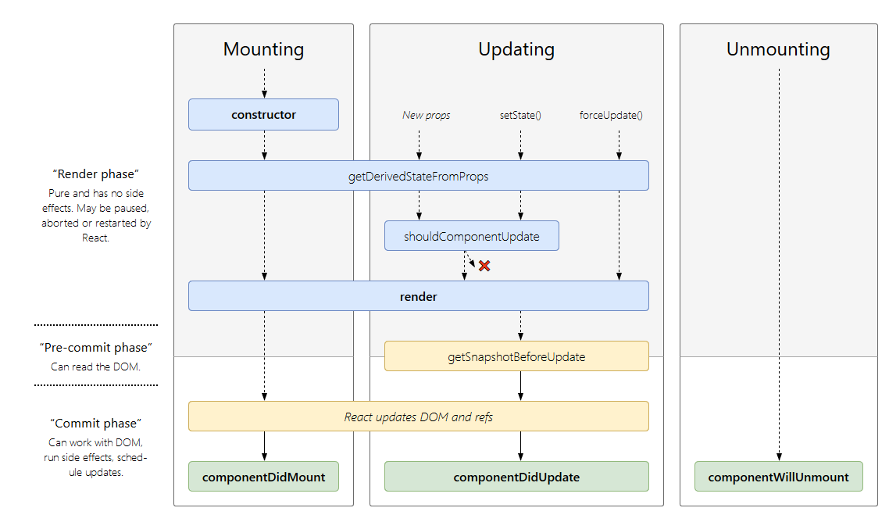

# React Core  
  - [Dissecting the building block of React: A Component](#dissecting-the-building-block-of-react-a-component)
  - [Defining a component](#defining-a-component)
  - [Using a component](#using-a-component)
  - [Types of component](#types-of-component)
    - [Functional Component](#functional-component)
  - [Component Lifecycle](#component-lifecycle)

## Dissecting the building block of React: A Component

The whole idea behind React is modularization and reusability. React components are the building blocks of this modularization. The idea is simple: you encapsulate your front end bits in components and then reuse them. Let's dissect a moderately complex React component:

### Defining a component

```
import React, { Component } from "react";

class Button extends Component {
    constructor(props) {
        super(props);
        this.state = { // [1]
            numOfClicks : 0
        }    
        this.handleClick = this.handleClick.bind(this); // [2]
    }

    handleClick() { // [3]
        // code to handle what happens when the button is clicked

        this.setState((state) => { // [4]
            return { numOfClicks: state.numOfClicks + 1 }; // Update current number of clicks by 1 since someone just clicked it
        });
    }

    render() { // [5]
        let buttonName = this.props.buttonName; // [1]
        return (
            <button onClick={this.handleClick}> // [6]
                {buttonName}
            </button>
        );
    }
}

export default Button; // [7]
```
1. We pass data to a React component using props. In our example, the parent component of Button i.e. whoever is rendering the <Button \/> component can pass in the button name using the buttonName prop. A component can hold data about itself in state. This is an object that describes the state of the component at that point of time.  To learn more about state vs props [click here](https://flaviocopes.com/react-state-vs-props/).
2. If we are passing in a function to another component, we have to bind 'this' to the function, so that when it gets called, it uses the correct 'this' context. For our example, since handleClick will be invoked by <button \/> html tag, we need to bind the 'this' context of our Button class to the function. To learn more, [click here](https://codeburst.io/binding-functions-in-react-b168d2d006cb).
3. We can define class methods for our own use. This is a good practice since it allows us to test individual bits of code by themselves.
4. Here we are updating the state for the class. Everytime the state changes, the component re renders.
5. Render is the only method you have to implement for every React component. This is what gets called when a component is rendered/invoked and in our case, outputs the html.
6. Our Button class ultimately will output this bit of html and paint the DOM with it. We are also rendering the button name from the passed in prop. 
7. We have to export our component so that we can use it. Whoever uses it will import this class. 

### Using a component

```
import Button from './Button.jsx';

class Header extends Component {
    render() {
        <Button buttonName='Login' />
    }
}

export default Header;
```

### Types of component

The example above is a React *class component* i.e. you create a class object. The other type of component is called a functional component, where you define the component as a function. 

#### [Functional Component](https://programmingwithmosh.com/react/react-functional-components/)
```
// Style 1
const Header = (props) => (<h1>{props.headerTitle}</h1>); // es6 automatically returns the h1 without the return keyword.

// Style 2

function Header(props) {
    return (<h1>{props.headerTitle}</h1>);
}   
```

Functional components are a bit more performant, easy to read and test. If you do not need state for your component, then go with functional components. To learn more, [click here](https://programmingwithmosh.com/react/react-functional-components/). 


### [Component Lifecycle](https://reactjs.org/docs/react-component.html)

Lifecycle methods are invoked during different lifecylce events of a component. If you want your component to execute some logic during different lifecycle events, you can add them to the appropriate lifecycle method.


*Fig 1: React Lifecyle. Image taken from reactjs.org*

<a><p style="text-align: right;">[Next: Running React](brush_up_running_react.md)</p></a>

